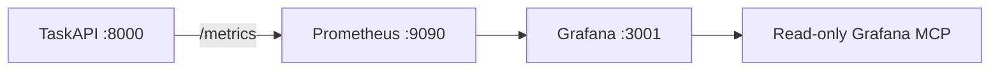
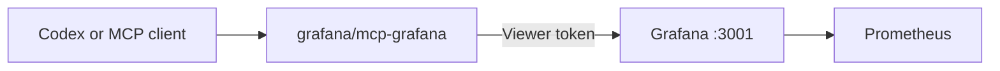

# TaskAPI

A small FastAPI task service with Prometheus metrics exposed at `/metrics`.

## Run the API

```bash
docker compose up --build taskapi
```

The API listens on `http://localhost:8000`.

Useful checks:

```bash
curl http://localhost:8000/health
curl http://localhost:8000/tasks
curl http://localhost:8000/metrics
```

## Beads UI

Start the local Beads board from this repo so it resolves `.beads` correctly:

```powershell
powershell -ExecutionPolicy Bypass -File scripts/start-beads-ui.ps1
```

| URL | Workspace |
| --- | --- |
| `http://127.0.0.1:3000` | `C:\Users\User\Downloads\taskapi\.beads` |

If the UI says no database was found, it was likely started from another
directory. Restart it with the script above.

## Local Observability Stack



Start the stack:

```bash
docker compose up --build
```

| Service | URL | Purpose |
| --- | --- | --- |
| TaskAPI | `http://localhost:8000` | API, `/health`, `/tasks`, `/metrics` |
| Prometheus | `http://localhost:9090` | Scrapes TaskAPI metrics |
| Grafana | `http://localhost:3001` | Provisioned dashboard |

Grafana uses `admin` / `admin` for local login and also allows anonymous viewer
access. Port `3001` avoids colliding with the Beads UI, which commonly runs on
`3000`.

| File | Role |
| --- | --- |
| `compose.yaml` | Runs TaskAPI, Prometheus, and Grafana |
| `infra/observability/prometheus/prometheus.yml` | Scrapes `taskapi:8000/metrics` |
| `infra/observability/grafana/provisioning/datasources/prometheus.yml` | Provisions the Prometheus datasource |
| `infra/observability/grafana/provisioning/dashboards/taskapi.yml` | Loads dashboard JSON files |
| `infra/observability/grafana/dashboards/taskapi-overview.json` | Starter TaskAPI dashboard |
| `infra/mcp/grafana` | Local read-only Grafana MCP config examples |

The starter dashboard is **TaskAPI / TaskAPI Overview** and includes scrape
health, request rate, status code rate, endpoint rate, and latency panels.

Generate traffic:

```bash
curl http://localhost:8000/health
curl http://localhost:8000/tasks
curl -X POST http://localhost:8000/tasks \
  -H "Content-Type: application/json" \
  -d '{"title":"Observe me","description":"Generate metrics"}'
curl http://localhost:8000/tasks
```

Verify:

| Check | Command |
| --- | --- |
| API health | `curl http://localhost:8000/health` |
| Prometheus target | `curl "http://localhost:9090/api/v1/targets?state=active"` |
| TaskAPI scrape status | `curl "http://localhost:9090/api/v1/query?query=up%7Bjob%3D%22taskapi%22%7D"` |
| Grafana dashboard | Open `http://localhost:3001/d/taskapi-overview/taskapi-overview` |

## Agent Grafana Access

| Path | Use |
| --- | --- |
| `infra/mcp/grafana` | Read-only local MCP access through `grafana/mcp-grafana` |



Use a Grafana `Viewer` service account token and keep it in
`GRAFANA_SERVICE_ACCOUNT_TOKEN`. The local examples disable write/admin MCP
tools and enable only search, datasource, alerting, dashboard, and Prometheus
inspection.

## Repo Layout

```bash
app/                         # FastAPI app and tests
infra/observability/          # Local Prometheus/Grafana config
infra/aws/observability/      # AWS AMP/AMG Terraform
infra/kubernetes/observability/ # ServiceMonitor and alert rules
infra/otel/                   # Optional traces/log correlation path
infra/mcp/grafana/            # Local read-only Grafana MCP config
compose.yaml                  # Local app + observability stack
Dockerfile                    # Python 3.11 runtime image
```

## AWS Terraform

| Path | Use |
| --- | --- |
| `infra/aws/observability` | Amazon Managed Service for Prometheus, optional Amazon Managed Grafana, IAM, and CloudWatch logs |

```bash
cd infra/aws/observability
copy terraform.tfvars.example terraform.tfvars
terraform init
terraform validate
terraform plan
```

## Stop

```bash
docker compose down
```
