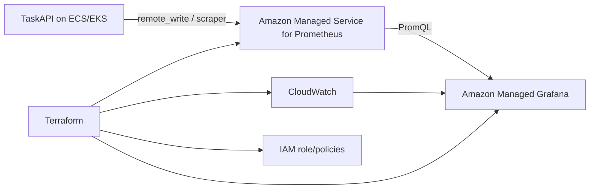

# AWS Observability Terraform



## Decision Matrix

| Area | Terraform? | Why |
| --- | --- | --- |
| Local Docker Compose | No | Fast dev loop, no AWS resource lifecycle |
| AMP workspace | Yes | Managed Prometheus is durable AWS infrastructure |
| AMP log group | Yes | Retention and naming should be repeatable |
| AMG workspace | Optional | Useful for AWS dashboards, but requires account auth prerequisites |
| Grafana dashboards | Later | Use Grafana API/provider only after workspace/auth model is chosen |
| EKS/ECS collectors | Later | Depends on deployment platform decision |

## Resources

| File | Purpose |
| --- | --- |
| `versions.tf` | Terraform and AWS provider requirements |
| `main.tf` | AMP workspace, optional AMG workspace, IAM, CloudWatch logs |
| `variables.tf` | Inputs and guardrails |
| `outputs.tf` | AMP/AMG IDs, endpoints, and role ARN |
| `terraform.tfvars.example` | Local variable template |
| `backend.tf.example` | Optional S3 remote state template |

## Commands

```bash
cd infra/aws/observability
copy terraform.tfvars.example terraform.tfvars
terraform init
terraform fmt -recursive
terraform validate
terraform plan
```

## AWS Prerequisites

| Need | Notes |
| --- | --- |
| AWS credentials | Use `aws configure sso`, environment variables, or an approved CI role |
| AWS region | Defaults to `us-east-1`; override in `terraform.tfvars` |
| Terraform state | Local by default; copy `backend.tf.example` to `backend.tf` for S3 state |
| Managed Grafana auth | Set `enable_managed_grafana = true` only after AWS SSO/auth is ready |

## Source Notes

| Topic | Source |
| --- | --- |
| AMP workspace model | <https://docs.aws.amazon.com/prometheus/latest/userguide/AMP-manage-ingest-query.html> |
| AMP Terraform resource | <https://registry.terraform.io/providers/hashicorp/aws/latest/docs/resources/prometheus_workspace> |
| AMG customer-managed role | <https://docs.aws.amazon.com/grafana/latest/APIReference/API_CreateWorkspace.html> |
| AMG datasource permissions | <https://docs.aws.amazon.com/grafana/latest/userguide/AMG-manage-permissions.html> |
| AMP datasource auth | <https://grafana.com/docs/grafana/latest/datasources/prometheus/configure/aws-authentication/> |
