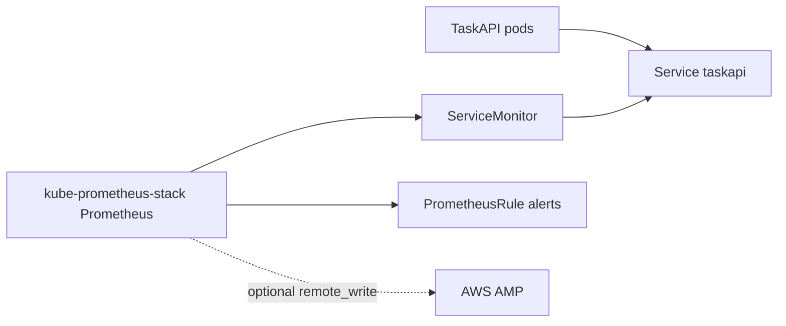

# Kubernetes Observability



## Assumptions

| Area | Value |
| --- | --- |
| Platform | Kubernetes or AWS EKS |
| Prometheus stack | `prometheus-community/kube-prometheus-stack` |
| TaskAPI pod labels | `app.kubernetes.io/name=taskapi`, `app.kubernetes.io/component=api` |
| TaskAPI metrics | `GET /metrics` on port `8000` |
| AWS path | Optional remote write to AMP from `infra/aws/observability` outputs |

## Files

| File | Purpose |
| --- | --- |
| `taskapi-service.yaml` | Stable scrape target for TaskAPI pods |
| `taskapi-servicemonitor.yaml` | Prometheus Operator scrape config |
| `taskapi-prometheusrules.yaml` | Starter scrape, 5xx, latency, and restart alerts |
| `kube-prometheus-stack-values.yaml` | Helm values so monitors/rules are selected outside Helm defaults |
| `kustomization.yaml` | Local manifest bundle |

## Install

```bash
helm repo add prometheus-community https://prometheus-community.github.io/helm-charts
helm repo update
helm upgrade --install kube-prometheus-stack prometheus-community/kube-prometheus-stack \
  --namespace monitoring \
  --create-namespace \
  -f infra/kubernetes/observability/kube-prometheus-stack-values.yaml

kubectl apply -k infra/kubernetes/observability
```

## Validate

| Check | Command |
| --- | --- |
| Render manifests | `kubectl kustomize infra/kubernetes/observability` |
| Service exists | `kubectl get svc taskapi` |
| ServiceMonitor selected | `kubectl get servicemonitor taskapi` |
| PrometheusRule loaded | `kubectl get prometheusrule taskapi` |
| Target discovered | Port-forward Prometheus and query `up{job="taskapi"}` |
| Alerts visible | Check Prometheus or Alertmanager for `TaskAPI*` rules |

## AWS Notes

| Topic | Direction |
| --- | --- |
| Metrics ingestion | Use in-cluster Prometheus first; add remote write to AMP after AWS credentials and environment are chosen |
| Dashboards | Use local Grafana for dev; use Amazon Managed Grafana or kube-prometheus-stack Grafana for cluster views |
| Terraform | Manage AMP/AMG/IAM/CloudWatch in `infra/aws/observability`; keep Kubernetes manifests here |
