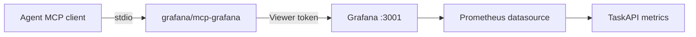

# Grafana MCP

Local, read-only agent access to the TaskAPI Grafana stack.



## Local Setup

Start the observability stack:

```powershell
docker compose up -d --build
```

Create a Grafana service account named `taskapi-mcp-readonly` with role
`Viewer`, then create a short-lived token and set it only in your shell:

```powershell
$env:GRAFANA_SERVICE_ACCOUNT_TOKEN = "<viewer-service-account-token>"
```

Use one of these local examples:

| Client | Example |
| --- | --- |
| Codex config | `infra/mcp/grafana/codex.config.example.toml` |
| Generic MCP JSON | `infra/mcp/grafana/mcp-grafana.local.example.json` |

The Docker-launched MCP server uses `http://host.docker.internal:3001` because
it runs inside a container and must reach Grafana on the host.

## Enabled Surface

| Setting | Value | Why |
| --- | --- | --- |
| Grafana role | `Viewer` | Least privilege for dashboards, data sources, and alert inspection |
| Transport | `stdio` | Local assistant process only |
| Disabled flags | `-disable-write`, `-disable-admin` | Remove write/admin MCP tools even if a token is overprivileged |
| Enabled tools | `search,datasource,alerting,dashboard,prometheus` | Enough for operational inspection |
| Secret handling | Environment variable | Token is not committed |

## Verification

| Check | Result |
| --- | --- |
| Grafana API datasource read | Viewer token listed `Prometheus` |
| Grafana API dashboard search | Viewer token found `TaskAPI Overview` |
| Grafana API alert rules read | Viewer token returned HTTP `200` |
| Grafana API folder write | Viewer token returned HTTP `403` |
| MCP tool list | No `create`, `update`, `delete`, `admin`, or `write` tool names exposed |
| MCP datasource read | `list_datasources` returned `Prometheus` |
| MCP dashboard search | `search_dashboards` returned `TaskAPI Overview` |
| MCP alert read | `alerting_manage_rules` with `operation=list` completed |
| MCP Prometheus query | `query_prometheus` returned `up{job="taskapi"} = 1` |

## Direct Prometheus MCP

| Option | Recommendation |
| --- | --- |
| Grafana MCP | Use first |
| Direct Prometheus MCP | Defer |

Grafana MCP is enough for the current repo because it can inspect dashboards,
data sources, alert rules, and Prometheus query results through the Grafana
permission model. Add a direct Prometheus MCP only if an agent needs Prometheus
target/runtime/admin data that Grafana does not expose.

## Sources

| Source | Use |
| --- | --- |
| [grafana/mcp-grafana](https://github.com/grafana/mcp-grafana) | MCP server image and local stdio transport |
| [Grafana service accounts](https://grafana.com/docs/grafana/latest/administration/service-accounts/) | Least-privilege token model |
| [Grafana alerting provisioning API](https://grafana.com/docs/grafana/latest/developer-resources/api-reference/http-api/api-legacy/alerting_provisioning/) | Alert-rule read verification |
