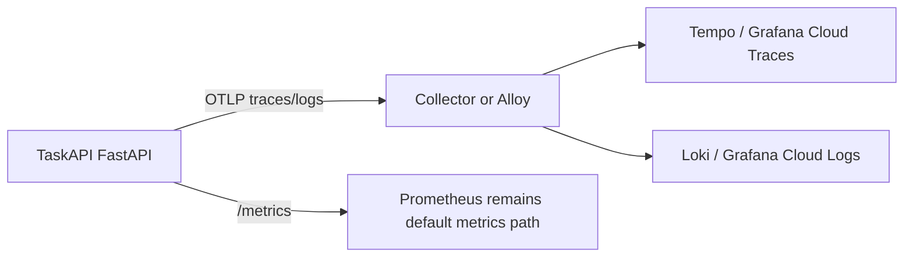

# OpenTelemetry Option



## Decision

| Question | Answer |
| --- | --- |
| Add OTel to runtime now? | No |
| Why? | The API is small and already has useful Prometheus HTTP metrics |
| When to add it? | When requests cross services, errors need trace IDs, or logs need correlation |
| Metrics path | Keep `prometheus-fastapi-instrumentator` for now |
| Trace/log path | Add optional OTel FastAPI + logging instrumentation and export OTLP |

## Python 3.11 Packages

| Package | Version | Notes |
| --- | --- | --- |
| `opentelemetry-api` | `1.42.1` | Stable API line |
| `opentelemetry-sdk` | `1.42.1` | Stable SDK line |
| `opentelemetry-exporter-otlp` | `1.42.1` | OTLP gRPC/HTTP exporters |
| `opentelemetry-instrumentation` | `0.63b1` | Beta instrumentation line |
| `opentelemetry-instrumentation-fastapi` | `0.63b1` | FastAPI ASGI spans |
| `opentelemetry-instrumentation-logging` | `0.63b1` | Log correlation fields |

Install only for an OTel branch or later implementation:

```bash
python -m pip install -r app/requirements-otel.txt
```

## FastAPI Hook

```python
from opentelemetry.instrumentation.fastapi import FastAPIInstrumentor

FastAPIInstrumentor.instrument_app(
    app,
    excluded_urls="/health,/metrics",
)
```

## Collector / Alloy

| File | Use |
| --- | --- |
| `infra/otel/collector.yaml` | OpenTelemetry Collector config |
| `infra/otel/alloy.river` | Grafana Alloy config |

Required environment variables:

| Variable | Example |
| --- | --- |
| `GRAFANA_CLOUD_OTLP_ENDPOINT` | `https://otlp-gateway-prod-us-east-0.grafana.net/otlp` |
| `GRAFANA_CLOUD_OTLP_BASIC_AUTH` | `<instance_id>:<token>` |

## Validate Later

| Check | Command |
| --- | --- |
| Python package availability | `python -m pip download --python-version 3.11 --implementation cp --abi cp311 --platform manylinux2014_x86_64 --only-binary=:all: -r app/requirements-otel.txt` |
| Collector config | `otelcol-contrib validate --config infra/otel/collector.yaml` |
| Alloy formatting | `alloy fmt --test infra/otel/alloy.river` |
| Alloy config | `alloy validate infra/otel/alloy.river` |
| App traces | Send a request and confirm spans exclude `/health` and `/metrics` |
| Logs | Confirm trace/span IDs appear in app log records |

## Implementation Trigger

Create a new implementation bead when at least one is true:

| Trigger | Why |
| --- | --- |
| Multiple services | Distributed traces become useful |
| Production incidents | Trace/log correlation shortens diagnosis |
| Async/background work | Spans show hidden latency |
| Grafana Cloud/Tempo/Loki ready | There is a real backend to receive OTLP |
